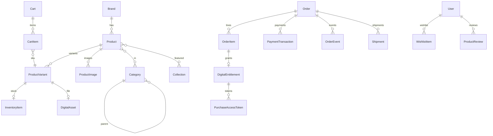

# تحلیل و طراحی پایه — 33 Label

> نسخه: **1.1**  
> وضعیت: **پیاده‌سازی Backend شروع شده** (اسکلت Onion + Migration اولیه + سرویس‌های اصلی)  
> برند / نام سایت: **33 Label**  
> ترتیب کار توافق‌شده: **Backend + Database + Migrations + منطق دامنه → سپس UI/UX** (داکیومنت UI جداگانه ارسال می‌شود)

---

## ۱. توافق رویکرد

| موضوع | تصمیم |
|--------|--------|
| استقلال پروژه | کاملاً **جدا** از اکوسیستم Novin / NovinPlay / NMO |
| الهام فنی | فقط **الگوی زیرساخت Backend**: ASP.NET Core MVC، SQL Server، EF Core، معماری Onion سبک |
| UI/UX | کاملاً مستقل؛ در این فاز ساخته نمی‌شود |
| ترتیب تحویل | ۱) Domain/Application/Infrastructure + Migrations + منطق پشت‌صحنه ۲) UI طبق داکیومنت جدا |
| نام Solution | `Label33` |
| نمایش برند | `33 Label` |

**موافق با این ترتیب هستم.** تا قبل از رسیدن داکیومنت UI، فقط اسکلت وب (Controllers نازک بدون View نهایی) برای تست منطق کافی است.

---

## ۲. الهام فنی از Backend مرجع (بدون وابستگی محصولی)

از سایت مرجع فقط این الگوها قرض گرفته می‌شود — نه برند، نه دامنه رسانه، نه AD، نه دانلود فایل کتابخانه:

| الگوی فنی مرجع | کاربرد در 33 Label |
|-----------------|---------------------|
| ASP.NET Core MVC + Areas | فروشگاه عمومی + `/Admin` |
| SQL Server + EF Core Migrations | پایداری schema |
| لایه‌بندی Onion (Domain → Application → Infrastructure → Web) | جداسازی منطق از UI |
| Application Services نازک + Controllers نازک | تست‌پذیری منطق |
| `IAppDbContext` به‌جای Repository اجباری | سادگی CRUD + Aggregateهای مشخص |
| State Machine برای چرخه وضعیت | چرخه سفارش |
| Options + DI Extension methods | پیکربندی تمیز |
| Hosted Service برای کارهای پس‌زمینه | آزادسازی رزرو موجودی / سبد رهاشده |
| توکن کوتاه‌عمر برای دسترسی فایل | دانلود فایل دیجیتال پس از خرید (در صورت وجود SKU دیجیتال) |

---

## ۳. فرض دامنه محصول 33 Label

نام **Label** معمولاً به برند پوشاک/استایل اشاره دارد. مدل داده طوری طراحی می‌شود که برای **فروشگاه برند پوشاک/لایف‌استایل** قوی باشد، اما به فیزیکی محدود نماند:

- واریانت‌های قوی: **Size / Color / Material** (Attribute محور)
- کالکشن‌های فصلی و ویترینی
- موجودی Tracked برای فیزیکی
- امکان SKU دیجیتال اختیاری (مثلاً الگوی برش، گیفت‌کارت) بدون اجباری بودن

اگر دامنه غیر از پوشاک باشد، همان مدل Product+Variant+Attribute همچنان قابل استفاده است.

---

## ۴. معماری Solution

```
Label33/
├── Label33.sln
├── docs/
│   └── ANALYSIS.md                 ← این سند
├── src/
│   ├── Label33.Domain/
│   ├── Label33.Application/
│   ├── Label33.Infrastructure/
│   └── Label33.Web/                ← ASP.NET Core MVC (composition root)
└── tests/
    └── Label33.Tests/
```

### جریان وابستگی

```
Web → Infrastructure → Application → Domain
Web → Application
Web → Domain (حداقلی، فقط در صورت نیاز ViewModel mapping)
```

| لایه | دارد | ندارد |
|------|------|--------|
| Domain | Entity، Enum، Value Object، OrderStateMachine | EF، HTTP، MVC |
| Application | Services، DTOs، Abstractions، Validation | Razor، SQL خام |
| Infrastructure | DbContext، Migrations، Payment/Email/File adapters | قوانین دامنه |
| Web | Controllers، Admin Area، DI، (بعداً Views) | Business rules سنگین |

---

## ۵. Bounded Contexts

1. **Catalog** — محصول، واریانت، ویژگی، دسته، برند، کالکشن، مدیا  
2. **Inventory** — موجودی، رزرو موقت  
3. **Pricing** — قیمت پایه، CompareAt، کوپن، پنجره فروش  
4. **Cart** — سبد کاربر/مهمان  
5. **Ordering** — سفارش، آیتم، آدرس، رویداد وضعیت  
6. **Payment** — تراکنش درگاه  
7. **Fulfillment** — ارسال فیزیکی / entitlement دیجیتال  
8. **Customer** — پروفایل، آدرس، Wishlist، Review  
9. **Ops** — تنظیمات، Audit، گزارش ادمین  

---

## ۶. مدل دامنه — انتیتی‌ها

### ۶.۱ پایه

```csharp
public abstract class EntityBase
{
    public Guid Id { get; set; }
    public DateTime CreatedAtUtc { get; set; }
    public DateTime? UpdatedAtUtc { get; set; }
}
```

شناسه پیش‌فرض: **Guid**. مبالغ: **IRR** با `decimal(18,0)` مگر خلافش اعلام شود.

---

### ۶.۲ Catalog

#### `Brand`
- Name, Slug (unique), LogoPath?, IsActive

#### `Category`
- Name, Slug, ParentCategoryId?, SortOrder, IsActive  
- درخت دسته‌بندی

#### `Product` (Aggregate Root کاتالوگ)
- Name, Slug (unique)
- ShortDescription?, FullDescription?
- BrandId?
- ProductType: `Physical | Digital | Bundle`
- Status: `Draft | Published | Archived`
- IsFeatured
- PublishedAtUtc?
- MetaTitle?, MetaDescription?
- Collections / Categories / Tags / Images / Variants

#### `ProductVariant` (واحد قابل فروش / SKU)
- ProductId
- Sku (unique)
- Title (مثلاً `Black / L`)
- BasePrice, CompareAtPrice?
- Currency (`IRR`)
- StockMode: `Tracked | Unlimited`
- WeightGrams?
- IsActive
- DigitalAssetId? (اگر دیجیتال)

#### `ProductAttribute` / `ProductAttributeValue` / `VariantAttributeValue`
مدل ویژگی منعطف برای Size/Color/... بدون ستون ثابت.

#### `ProductImage`
- ProductId, VariantId?, PathOrUrl, SortOrder, AltText?, IsPrimary

#### `Tag`, `ProductTag`, `ProductCategory`
چندبه‌چند استاندارد

#### `Collection`, `CollectionItem`
ویترین‌های فصلی/کمپین: Title, Slug, HeroImagePath?, SortOrder, IsPublished

#### `DigitalAsset` (اختیاری)
- StorageKey, FileName, ContentType, SizeBytes, Checksum?, MaxDownloads?

---

### ۶.۳ Inventory

#### `InventoryItem`
- ProductVariantId (unique)
- QuantityOnHand
- QuantityReserved
- ReorderLevel?
- Available = OnHand − Reserved

#### `InventoryReservation`
- CheckoutSessionId / CartId
- ProductVariantId
- Quantity
- ExpiresAtUtc
- Status: `Active | Consumed | Released | Expired`

هدف: جلوگیری از oversell در Checkout.

---

### ۶.۴ Pricing & Promo

#### `Coupon`
- Code (unique)
- DiscountType: `Percent | FixedAmount`
- Value
- MinOrderAmount?
- MaxUses?, UsedCount
- StartsAtUtc?, EndsAtUtc?
- IsActive

#### `CouponRedemption`
- CouponId, OrderId, UserId, RedeemedAtUtc

#### `SalesWindow` (اختیاری)
- Name, Scope (Variant/Collection/Global)
- StartUtc, EndUtc, TimeZoneId, IsEnabled

---

### ۶.۵ Cart

#### `Cart`
- UserId? (null = مهمان)
- AnonymousToken?
- Currency
- Status: `Open | Converted | Abandoned`

#### `CartItem`
- CartId, ProductVariantId, Quantity
- UnitPriceSnapshot
- AddedAtUtc

قوانین:
- ادغام سبد مهمان → کاربر بعد از Login
- قیمت در Checkout دوباره Validate می‌شود

---

### ۶.۶ Ordering

#### `Order` (Aggregate Root)
- OrderNumber (unique, انسانی؛ مثلاً `33L-20260910-00041`)
- UserId
- Status (State Machine)
- Subtotal, DiscountTotal, ShippingTotal, TaxTotal, GrandTotal
- Currency
- CouponId?
- ShippingAddress snapshot
- CustomerNote?
- PaidAtUtc?, CancelledAtUtc?, CompletedAtUtc?

#### `OrderItem`
- OrderId
- ProductVariantId
- ProductNameSnapshot, SkuSnapshot, VariantTitleSnapshot
- ProductTypeSnapshot
- UnitPrice, Quantity, LineTotal
- DigitalAssetId?

#### `OrderAddress`
- FullName, Phone, Province, City, PostalCode, Line1, Line2?

#### `OrderEvent`
- OrderId, FromStatus?, ToStatus, Message, ActorUserId?, CreatedAtUtc  
  (timeline ممیزی مثل event log سیستم‌های pipeline)

---

### ۶.۷ Order State Machine

```
Draft
 → AwaitingPayment
 → Paid
 → Fulfilling
 → PartiallyFulfilled
 → Completed
 → Cancelled
 → Refunded
```

انتقال‌های غیرمجاز در Domain رد می‌شوند (`OrderStateMachine`).

---

### ۶.۸ Payment

#### `PaymentTransaction`
- OrderId
- Provider (`Mock` در فاز ۱، بعداً درگاه واقعی)
- ProviderRef?
- Amount
- Status: `Pending | Succeeded | Failed | Refunded`
- RawCallbackPayload?
- CreatedAtUtc, CompletedAtUtc?

---

### ۶.۹ Fulfillment

#### `Shipment`
- OrderId, Carrier?, TrackingCode?
- Status: `Preparing | Shipped | Delivered | Returned`
- ShippedAtUtc?, DeliveredAtUtc?

#### `DigitalEntitlement`
- OrderItemId, UserId, DigitalAssetId
- DownloadsUsed, MaxDownloads?, ExpiresAtUtc?

#### `PurchaseAccessToken`
- EntitlementId
- TokenHash
- ExpiresAtUtc
- UsedAtUtc?
- IsRevoked

---

### ۶.۱۰ Customer / Social

#### `CustomerProfile`
- UserId (Identity), DisplayName?, Phone?, AvatarPath?

#### `CustomerAddress`
- UserId + فیلدهای آدرس + IsDefault

#### `WishlistItem`
- unique(UserId, ProductId)

#### `ProductReview`
- UserId, ProductId, Rating (1–5), Title?, Body?
- Status: `Pending | Approved | Rejected`
- HelpfulCount

#### `ProductReviewVote`
- unique(ReviewId, UserId), IsHelpful

---

### ۶.۱۱ Identity & Ops

- ASP.NET Core Identity (`AspNetUsers`, Roles, …)
- Roles: `Customer`, `Admin`, `CatalogManager`, `OrderManager`
- `SiteSetting` (Key/Value)
- `AuditLog`
- `PageViewLog` / `OnlineUser` (برای داشبورد ادمین؛ UI بعداً)

---

## ۷. ER منطقی



---

## ۸. دیتابیس SQL Server

- نام DB: **`Label33Db`**
- ORM: EF Core
- همه تغییرات schema فقط با **Migrations**

### جداول فاز Backend

**Catalog:** Brands, Categories, Products, ProductVariants, ProductAttributes, ProductAttributeValues, VariantAttributeValues, ProductImages, Tags, ProductTags, ProductCategories, Collections, CollectionItems, DigitalAssets  

**Commerce:** Carts, CartItems, InventoryItems, InventoryReservations, Coupons, CouponRedemptions, SalesWindows  

**Orders:** Orders, OrderItems, OrderAddresses, OrderEvents, PaymentTransactions, Shipments, DigitalEntitlements, PurchaseAccessTokens  

**Customer:** CustomerProfiles, CustomerAddresses, WishlistItems, ProductReviews, ProductReviewVotes  

**Ops + Identity:** SiteSettings, AuditLogs, PageViewLogs, OnlineUsers, AspNet*

### ایندکس‌های حیاتی

| جدول | ایندکس |
|------|--------|
| Products | unique(Slug); (Status, PublishedAtUtc DESC) |
| ProductVariants | unique(Sku); (ProductId, IsActive) |
| CartItems | unique(CartId, ProductVariantId) |
| Orders | unique(OrderNumber); (UserId, CreatedAtUtc DESC); (Status) |
| PaymentTransactions | (Provider, ProviderRef) |
| InventoryReservations | (Status, ExpiresAtUtc) |
| WishlistItems | unique(UserId, ProductId) |
| PurchaseAccessTokens | unique(TokenHash) |

---

## ۹. Application Services (منطق پشت‌صحنه)

| سرویس | مسئولیت |
|--------|----------|
| `ProductCatalogQuery` / `ProductAdminService` | خواندن کاتالوگ + CRUD ادمین |
| `CartService` | Add/Update/Remove، Merge مهمان |
| `InventoryService` | Reserve / Release / Consume |
| `CheckoutService` | ساخت Order از Cart + Validate |
| `OrderService` | تغییر وضعیت با State Machine |
| `PaymentOrchestrator` | Initiate + Verify callback |
| `FulfillmentService` | Shipment / DigitalEntitlement |
| `AccessTokenService` | صدور/مصرف توکن دانلود |
| `CouponService` | Validate + Apply |
| `WishlistService` | Toggle |
| `ReviewService` | Submit + Moderate |
| `AdminDashboardQuery` | آمار سفارش/موجودی |

### Ports (Abstractions)

```
IAppDbContext
IPaymentGateway
IEmailSender
IFileStorage
IClock
IOrderNumberGenerator
```

پیاده‌سازی‌ها فقط در Infrastructure. فاز ۱ پرداخت = **MockPaymentGateway**.

---

## ۱۰. Web (بدون UI نهایی)

در فاز Backend:

- Controllers عمومی و Admin فقط برای فراخوانی سرویس‌ها
- Viewهای نهایی ساخته نمی‌شوند (یا placeholder خیلی ساده برای smoke test)
- Auth: Cookie Identity + Policy `AdminOnly`
- وقتی داکیومنت UI آمد، فقط لایه Web/Views تکمیل می‌شود؛ Domain/Application دست‌نخورده می‌ماند

### Controllers اسکلت

**Public:** Home, Catalog, Products, Cart, Checkout, Orders, Account, Wishlist, Payments (callback), Downloads  
**Admin:** Dashboard, Products, Categories, Inventory, Orders, Coupons, Reviews, Settings

---

## ۱۱. سناریوهای Backend که باید با تست پوشش داده شوند

1. افزودن واریانت به سبد و ادغام سبد مهمان  
2. Checkout با رزرو موجودی و انقضای Reservation  
3. پرداخت Mock موفق → Order Paid → Consume stock  
4. پرداخت ناموفق → آزادسازی Reservation  
5. سفارش فیزیکی → Shipment → Completed  
6. سفارش دیجیتال → Entitlement → AccessToken یک‌بارمصرف/کوتاه‌عمر  
7. کوپن درصد/مبلغ ثابت با سقف و انقضا  
8. انتقال وضعیت غیرمجاز Order رد شود  
9. Wishlist و Review moderation  

---

## ۱۲. نقشه فاز Backend (قبل از UI)

| فاز | خروجی |
|-----|--------|
| **A — تحلیل** | همین سند |
| **B — اسکلت Onion** | Solution چهارلایه + Test project |
| **C — Domain کامل** | تمام Entity/Enum + OrderStateMachine |
| **D — Infrastructure** | AppDbContext + Fluent config + Migration اولیه SQL Server |
| **E — Application** | سرویس‌های بخش ۹ + Mock payment |
| **F — Web wiring** | Controllers اسکلت + Identity + DI (بدون UI نهایی) |
| **G — Tests** | تست واحد/یکپارچگی سناریوهای بخش ۱۱ |
| **H — UI** | بعد از دریافت داکیومنت UI از شما |

---

## ۱۳. تصمیم‌های باز (کوتاه)

اگر خلاف این‌ها مدنظرت است بگو؛ وگرنه با همین‌ها جلو می‌رویم:

1. دامنه پیش‌فرض: **برند فروشگاهی پوشاک/لایف‌استایل** با Attribute Size/Color  
2. ارز: **IRR**  
3. Checkout مهمان: سبد مهمان OK؛ قبل از پرداخت Login/Register اجباری  
4. پرداخت فاز ۱: **Mock**  
5. فایل دیجیتال: اختیاری از روز اول در مدل، پیاده‌سازی storage محلی ساده  

---

## ۱۴. قدم بعدی بلافاصله بعد از تأیید این تحلیل

1. ساخت `Label33.sln` و پروژه‌های Onion  
2. پیاده‌سازی تمام Entityها  
3. `AppDbContext` + اولین Migration روی `Label33Db`  
4. سرویس‌های Application + تست‌ها  
5. متوقف شدن قبل از UI نهایی

---

*پایان تحلیل 33 Label v1.0*
